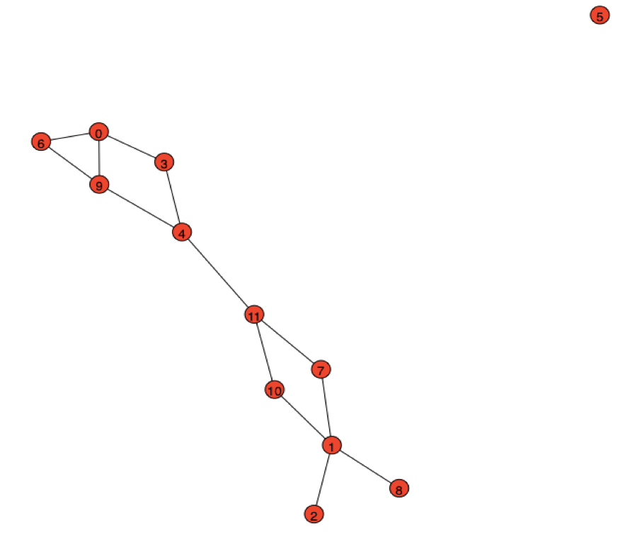

# GraphGeneration

Write a program to search the space of all possible networks of a given size n to find a network with this property for (i) degree, (ii) harmonic, (iii) betweenness, and (iv) eigenvector centralities, or report that no such network exists for that size. Run this program for n = 3, 4, 5, . . . and report the smallest value of n for which at least one such network exists. 
Visualize that network, label all the vertices, and indicate which ones win at which centrality measure; and produce a table in which the columns show the ranked vertices and scores for these centrality measures. Comment briefly about what insights you gained about how to build networks that have distinct winners for different measures of centrality. 

For number of nodes:  11
Doesn’t exist (could find at least, for n = 3 ,… , 11)

For number of nodes:  12

Number of edges:  13
node:  1  degree centrality:  4
node:  0  degree centrality:  3
node:  4  degree centrality:  3
node:  9  degree centrality:  3
node:  11  degree centrality:  3
node:  3  degree centrality:  2
node:  6  degree centrality:  2
node:  7  degree centrality:  2
node:  10  degree centrality:  2
node:  2  degree centrality:  1
node:  8  degree centrality:  1
node:  5  degree centrality:  0
node with the highest degree centrality : 1 

node:  11  betweenness centrality:  0.46
node:  4  betweenness centrality:  0.45
node:  1  betweenness centrality:  0.32
node:  9  betweenness centrality:  0.19
node:  7  betweenness centrality:  0.16
node:  10  betweenness centrality:  0.16
node:  3  betweenness centrality:  0.06
node:  0  betweenness centrality:  0.03
node:  8  betweenness centrality:  0.0
node:  2  betweenness centrality:  0.0
node:  5  betweenness centrality:  0.0
node:  6  betweenness centrality:  0.0
node with the highest betweenness centrality : 11

node:  4  harmonic centrality:  5.83
node:  11  harmonic centrality:  5.82
node:  1  harmonic centrality:  5.73
node:  9  harmonic centrality:  5.32
node:  7  harmonic centrality:  5.17
node:  10  harmonic centrality:  5.17
node:  0  harmonic centrality:  4.87
node:  3  harmonic centrality:  4.82
node:  6  harmonic centrality:  4.37
node:  2  harmonic centrality:  3.82
node:  8  harmonic centrality:  3.82
node:  5  harmonic centrality:  0.0
node with the highest harmonic:  4

node:  9  eigenvector centrality:  0.44
node:  0  eigenvector centrality:  0.42
node:  4  eigenvector centrality:  0.41
node:  6  eigenvector centrality:  0.33
node:  3  eigenvector centrality:  0.32
node:  11  eigenvector centrality:  0.32
node:  1  eigenvector centrality:  0.22
node:  7  eigenvector centrality:  0.21
node:  10  eigenvector centrality:  0.21
node:  2  eigenvector centrality:  0.09
node:  8  eigenvector centrality:  0.09
node:  5  eigenvector centrality:  0.0
node with the highest eigenvector:  9

Visualization of graph with four distinct node centrality measures for n = 12:

The node can have the highest degree centrality but in order to have different nodes with different highest centrality measure, it has to be located somewhere in the outer space of graph, because there have to be room for such a node that has to have highest, for example, betweenness centrality. Because betweenness centrality simply measures the linkedness of a node with other communities in a whole network, not only the community that this node lies in. Such a pattern can be seen in the picture above.
